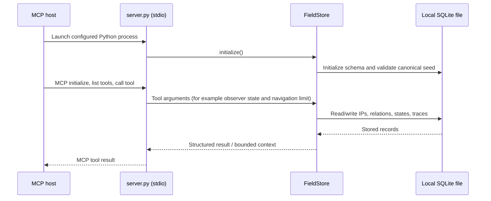
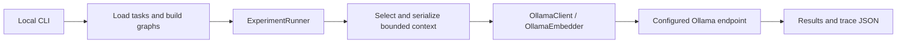

# Authentication, request flow, and token handling

The local engines and plugin do **not** implement user login authentication.
The paths below have different trust boundaries. An archived cloud prototype
does use an external provider API key, described separately below. Repository
access through GitHub is separate from application/provider credentials.

## Components

| Component | Source | Boundary |
| --- | --- | --- |
| Windows plugin launcher | [`launch_stoe_memory.cmd`](../plugins/stoe-memory/scripts/launch_stoe_memory.cmd), [`.mcp.json`](../plugins/stoe-memory/.mcp.json) | Launches a local process; configuration requests host-side tool approval |
| MCP server | [`server.py`](../plugins/stoe-memory/server.py) | Exposes tools over stdio; does not listen on HTTP |
| Persistent field | [`core.py`](../plugins/stoe-memory/core.py) | Local SQLite file and OS permissions |
| Experiment entry point | [`cli.py`](../experiments/stoe_v9_1_experiment/src/stoe_v9/cli.py) | Local CLI invocation |
| Model/embedding client | [`providers.py`](../experiments/stoe_v9_1_experiment/src/stoe_v9/providers.py) | Unauthenticated requests to configured Ollama URL |
| Earlier web engine | [`server.py`](../engine/v7/server.py), [`field.py`](../engine/v7/field.py) | Flask endpoints and local JSON state; no login checks |

## Plugin flow

The server constructs `FieldStore()` at startup and calls `initialize()`, then
runs with `transport="stdio"`. It does not create a web login, cookie, JWT,
access token, or refresh token. `.mcp.json` asks for tool approval using
`default_tools_approval_mode: "approve"`; enforcement belongs to the MCP host,
not to an authentication check inside `FieldStore`.

`default_db_path()` uses `STOE_MEMORY_DB` if provided; otherwise it uses
`LOCALAPPDATA` or the home directory and appends `SToE/field.sqlite3`.
`STOE_MEMORY_DB` is a file location, not a credential. SQLite calls use parameter
binding in the storage layer, but the application adds no encryption or
per-user ACLs. References and `session_id` values identify/group records and
are not authorization tokens.

Retrieved reasoning content is returned to the host and can subsequently enter
model context. The plugin itself does not call a model provider.

## Experiment flow

`OllamaClient` requests `/api/tags` and posts task/context messages to
`/api/chat`. `OllamaEmbedder` posts text to `/api/embed`. POST requests set
`Content-Type: application/json`; there is no `Authorization` header or API-key
lookup in these clients. The CLI defaults to `http://127.0.0.1:11434`, but
`--api-base` can target another service. The program does not require loopback,
HTTPS, or an authenticated proxy.

Expected model/embedding digests check model identity for reproducibility.
They are not access credentials. `input_tokens`, `output_tokens`, and
`max_output_tokens` refer to model token counts/budgets. The navigator's
`token_set` refers to lexical tokenization. Neither use represents authentication.

The archived run setup and its narrow experimental claims are documented in
[the frozen invocation](../experiments/stoe_v9_1_experiment/V9_1_REPRODUCTION_COMMAND.txt)
and [the final report](../experiments/stoe_v9_1_experiment/V9_1_FINAL_REPORT.md).

## Earlier v7 web flow

The browser UI calls Flask `/api/...` endpoints. Handlers read and mutate
`InformationField`, persist JSON, and call Ollama through `requests` for model
operations. Some endpoints save or serve logs. The code has no authentication
middleware or route-level ownership checks, including the field wipe/import
and model/chat endpoints.

`load_dotenv()` reads a local `.env`; relevant settings include `VERSION`,
`OLLAMA_URL`, and `OLLAMA_MODEL`. No password/token verification is implemented.
The CORS response lists `Authorization` as an allowed header, but this does not
validate that header or create authentication. CORS is not an authorization
mechanism. The historical entry point binds `0.0.0.0:5000`; the
[v7 README](../engine/v7/README.md) documents a loopback-only invocation.

## Credentials and lifecycle

### Historical additions: v3 and the original prototype

The [v3 client](../experiments/stoe_v3/core/llm.py) posts to the configured
Ollama `/api/chat` endpoint with model/messages/stream fields and no Bearer
header. It has no login/token lifecycle. Its local field and trial IDs are
data identifiers rather than credentials.

The [original prototype](../archive/original_prototype/engine.py) calls
`load_dotenv()`, reads `OPENROUTER_API_KEY` from the environment, and constructs
`Authorization: Bearer <key>` for OpenRouter's chat-completions endpoint.
The key is not embedded in the source and no `.env` is published. Prompts leave
the machine when that prototype runs; input/output logs are written locally.
The prototype does not issue, refresh, rotate, encrypt, or revoke that provider
key. Key provisioning and revocation belong to the provider/account owner.

The [source snapshot archive](../archive/snapshots/README.md) contains historical
variants, some with cloud-provider integrations. It intentionally excludes all
environment and runtime-memory files. Do not infer that every archived version
has the same network behavior as the current local components.

### Current local components

There are no application passwords to hash, login sessions to expire, tokens
to rotate, or logout/revocation endpoints in the supplied implementations.
GitHub credentials used to publish or clone are managed outside SToE and are
not copied into source, plugin config, or seed data. Operating-system file
permissions and host/client controls are essential for the local components;
shared or remote deployment needs additional authentication and authorization.

This explanation is a static code inspection, not a penetration test or proof
that the applications are safe to expose publicly.
