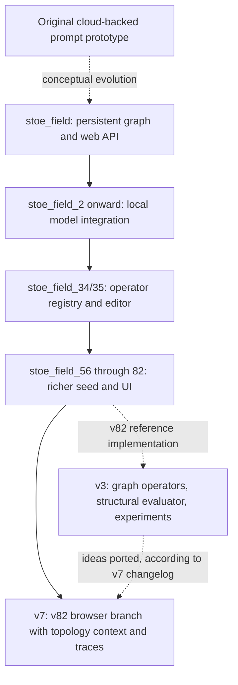

# What the snapshots tell us

Begin with the [original engine and output compilation](../archive/starting_point):
the code PDF and 55 output-file records selected by the author establish the
project's documentary starting point before the numbered graph snapshots.

This history is reconstructed from the available local source directories,
file hashes, and the cumulative changelog. It is not recovered Git history.
There are **78 `stoe_field*` source snapshots**, with missing numbers and an
extra `stoe_field_19_1` label. Folder names and file timestamps alone cannot
establish exact authorship, release dates, or branch ancestry.

## The main development paths

The arrows are an architectural reconstruction, not a claim of commit ancestry.
The [v7 changelog](../engine/v7/CHANGELOG.md) explicitly calls v7 a fresh track
from v82 and says it imported insights from v3. Consequently, the labels v3,
v7, and v82 must not be read as one simple ascending release sequence.

## Observable milestones

| Available snapshot | Evidence in source | What changed |
| --- | --- | --- |
| Original `engine.py` | OpenRouter HTTP request, prompt operators, `score_step` | Interactive idea transformation with cloud calls and LLM self-scoring |
| `stoe_field` | `field.py`, Flask server, browser UI, `failed_from` relations | Persistent graph representation and a web interface are already present |
| `stoe_field_2` | First available numbered source with Ollama URL markers | Local-model support appears; this marker alone does not prove all cloud paths were removed |
| `stoe_field_10` / `11` / `26` | Wipe, agent-chat, and field-merge routes | Application/data-management capabilities expand, including destructive operations |
| `stoe_field_34` / `35` | New `operators.py`, registry imports, operator-save endpoint | Centralized operator definitions, summarize operator, and persistent custom-operator editing |
| `stoe_field_39` | Edit/delete APIs and hard deletion in `server.py` | Graph editing expands, but the implementation does not enforce the stated no-deletion ideal |
| `stoe_field_56` to `82` | Successive supplied `stoe_seed.json` files | Seed representation gains connectivity, expressions, named paper nodes, and a richer schema |
| v3 | Operator preconditions; `StructuralEvaluator`; benchmark context builders | Graph state starts controlling operations and evaluation; experiments test consequences |
| v7 | `_topology_context`, shared prompt assembly, context-preview and trace routes | Browser generation gains inspectable graph context and saved provenance |

The markers in the [snapshot manifest](../archive/snapshots/manifest.json) are
simple source-string observations. They locate available milestones, not first
invention dates or proof of complete feature behavior.

## Seed evolution that can be verified

These are the first available numbered snapshots containing each distinct
standalone seed asset; missing version directories limit the resolution.

| Snapshot | Nodes | Edges |
| --- | ---: | ---: |
| `stoe_field_56` | 26 | 31 |
| `stoe_field_75` | 26 | 45 |
| `stoe_field_79` | 30 | 58 |
| `stoe_field_81` | 31 | 63 |
| `stoe_field_82` | 36 | 113 |

The v82 seed matches the currently packaged canonical seed, SHA-256
`b327db6dbce9981ed21561b9d1a857e2e3786f1391d41edc0381fead79e59868`.
Earlier seed versions are historical assets, not replacements for that seed.

## What the pattern suggests

Much of the numbered sequence is application engineering. Across the 78
snapshots, `static/index.html` has 71 distinct byte versions, `server.py` 62,
and `field.py` 12. Some changes are version strings or formatting, so distinct
hash counts do not measure algorithmic progress. The changelog corroborates
many selection, sorting, modal, import/export, and startup fixes.

The larger architectural change is the movement from storing a graph to
actually using graph relations in model context, operations, and evaluation.
The v7 source adds `_topology_context`, `_build_operator_prompt`,
`context_preview`, `get_trace`, and `put_trace` relative to v82. Its changelog
also records a fix connecting generated answers to source IPs.

However, v7's changelog explicitly says it did **not** port v3's structural
evaluator, operator refusal/precondition logic, or Ghost-node failure
conservation. Thus a feature present in an experimental branch is not
automatically present in the interactive application. The older web APIs also
permit hard deletion/wipe, whereas v3 tests enforce a monotonic field API.

Source snapshots demonstrate implementation changes; they do not establish
improved reasoning accuracy. The archived v3 Experiment 6 A/B comparison was
233/300 versus 234/300, with no detected native-adjacency advantage under that
setup. See the [evidence summary](../experiments/stoe_v3/runs/README.md), including
the limited number of puzzles and historical protocol/configuration gaps.

## Preservation and future work

All 78 available source snapshots are preserved in a deduplicated archive:
457 file occurrences, 266 distinct blobs, about 2.7 MB compressed. The original
ZIPs, `.env` files, runtime fields, loose logs, and custom operator state are excluded.
The current v7 source and its ZIP matched the already published v7 files, so
another v7 copy was unnecessary. Restore a milestone with the
[snapshot tool](../archive/snapshots/README.md).

The history suggests a useful future integration task: evaluate v3's
precondition/refusal and structural-evaluation mechanisms in the interactive
engine, while retaining v9.1's context-exposure checks and stronger retrieval
comparators. That is a proposal, not a change made during archival publication.
